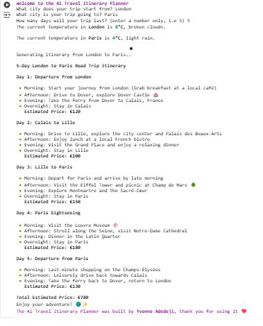

# ai-travel-itinerary-planner

## 📌 Description
The AI Travel Itinerary Planner is a Python-based tool that generates a travel itinerary between two locations using AI. It also provides real-time weather updates for the departure and destination cities to help travellers prepare for their journey.

## 🛠 Prerequisites
N/A

## 📋 Criteria
* Fetch real-time weather data for the origin and destination.
* Generate a concise travel itinerary based on user input.
* Use AI to suggest travel activities and estimated daily costs.
* Enhance output readability with emojis and Markdown formatting.

 ## 💻 Technologies Used
The application is built with the following technologies:
* Python: The core programming language.
* Requests: To make API calls.
* Rich: To enhance text formatting in the terminal.
* SheCodes Weather API: To fetch real-time weather data.
* SheCodes AI API: To generate a travel itinerary.

## 🚀 Installation
No installation is required to use the app. It is hosted online and can be accessed via a web browser.

## 📚 Usage
Run the script

Follow the prompts:

1. Enter your departure city.

2. Enter your destination city.

3. Enter the number of days for your trip.

The program will:
Display real-time weather for both locations.
Generate an AI-powered travel itinerary with estimated costs.

## 🔗 Live Demo & Repository
Application can be viewed here: 
* [Live](https://colab.research.google.com/drive/16BtzMUKqmj9YyG1IE4cB429e0wD3OPB4?usp=sharing)

* [Repository](https://github.com/yvonnesarah/travel-planner-project)

## 🖼 Screenshot
Below is a preview of Travel Planner:

## 👥 Credit
N/A

## 📜 License
This project is open-source. For licensing details, please refer to the LICENSE file in the repository.

## 📬 Contact
You can reach me at 📧 yvonneadedeji.sarah@gmail.com.
